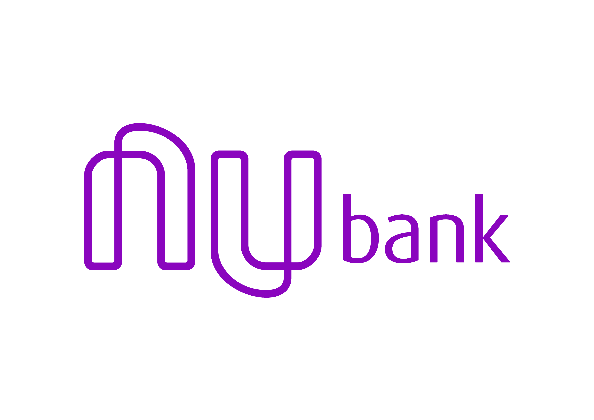

# :bank: Nubank Clone UI

A Nubank Clone UI app made with [vue-native](https://vue-native.io/) using [expo](https://docs.expo.io/) and [nativebase](https://nativebase.io/).

# :clapper: Preview

---

    

---

# :pushpin: Table of Contents

* [Features](#rocket-features)
* [System Requirements](#computer-system-requirements)
* [Installation](#construction_worker-installation)
* [Running the App](#tophat-running-the-app)
* [Found a bug? Missing a specific feature?](#bug-issues)
* [Contributing](#tada-contributing)
* [License](#closed_book-license)
* [Credits](#confetti_ball-credits-to-rocketseat)

# :rocket:  Features

- Up/down Card Animation
- Opacity Animations 
- Preload blurred footer
- QRCode Component (PS:. Just for IOs at the moment)

# :computer: System Requirements

 - Globally installed node >= 6.0
 - Globally installed npm or yarn
 - Globally installed Expo CLI

# :construction_worker: Installation

    $ git clone https://github.com/davidwlfreitas/nubank-clone-ui.git
    $ cd nubank-clone-ui

Install project dependencies with npm or yarn:

    $ npm install
or

    $ yarn

# :tophat: Running the App

    $ npm run start
or

    $ yarn start

## Alternatively, you can start the app directly on platform simulators:
### iOS

    $ npm run ios
or

    $ yarn ios

This works just like start, but also attempts to open your app in the iOS Simulator if you’re on a Mac and have it installed.

### Android

    $ npm run android
or

    $ yarn android

This works just like start, but also attempts to open your app on a connected Android device or emulator. It requires an installation of Android build tools (see the React Native docs for detailed setup).

# :bug: Issues

Feel free to **file a new issue** with a respective title and description on the the [Nubank Clone UI](https://github.com/davidwlfreitas/nubank-clone-ui/issues) repository. If you already found a solution to your problem, **I would love to review your pull request**! Have a look at our [contribution guidelines](https://github.com/davidwlfreitas/nubank-clone-ui/blob/master/CONTRIBUTING.md) to find out about the coding standards.

# :tada: Contributing

Check out the [contributing](https://github.com/davidwlfreitas/nubank-clone-ui/blob/master/CONTRIBUTING.md) page to see the best places to file issues, start discussions and begin contributing.

# :closed_book: License

Released in 2019. This project is under the [MIT license](https://github.com/davidwlfreitas/nubank-clone-ui/blob/master/LICENSE).

# :confetti_ball: Credits to [Rocketseat](https://rocketseat.com.br/)

A huge thanks to the Rocketseat Team for the amazing contribution through excellent React Native Training Courses.

Made with :beers: by [David Freitas](https://github.com/davidwlfreitas) :8ball:
