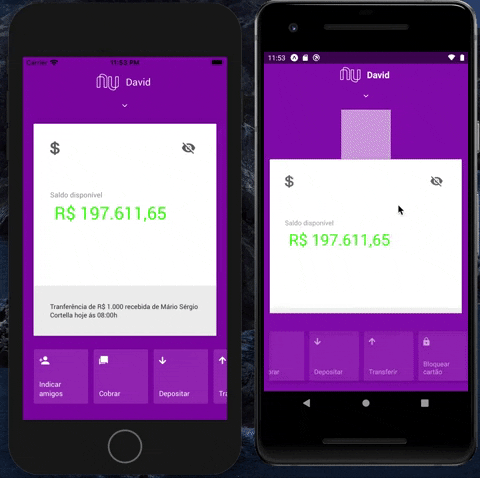

# :bank: Nubank Clone UI

A Nubank Clone UI app made with [vue-native](https://vue-native.io/) using [expo](https://docs.expo.io/) and [nativebase](https://nativebase.io/).

## :rocket:  Features

- Up/down Card Animation
- Opacity Animations 
- Preload blurred footer
- QRCode Component (PS:. Just for IOs at the moment)

## :clapper: Preview

## :pushpin: System Requirements

 - Globally installed node >= 6.0
 - Globally installed npm or yarn
 - Globally installed Expo CLI

## :construction_worker: Installation

    $ git clone https://github.com/davidwlfreitas/nubank-clone-ui.git
    $ cd nubank-clone-ui

Install project dependencies with npm or yarn:

    $ npm install
or

    $ yarn

## :tophat: Running the App

    $ npm run start
or

    $ yarn start

### Alternatively, you can start the app directly on platform simulators:
#### iOS

    $ npm run ios
or

    $ yarn ios

This works just like start, but also attempts to open your app in the iOS Simulator if you’re on a Mac and have it installed.

#### Android

    $ npm run android
or

    $ yarn android

This works just like start, but also attempts to open your app on a connected Android device or emulator. It requires an installation of Android build tools (see the React Native docs for detailed setup).

## :closed_book: License

This project is under the [MIT license](https://github.com/davidwlfreitas/nubank-clone-ui/blob/master/LICENSE).

## :tada: Credits to [Rocketseat](https://rocketseat.com.br/)

A huge thanks to the Rocketseat Team for the amazing contribution through excellent React Native Training Courses.

Made with :beers: by [David Freitas](https://github.com/davidwlfreitas) :8ball:
